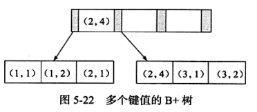

## Cardinality 值

Cardinality 值表示索引中不重复记录数量的预估值，在实际应用中，Cardinality/n_rows_in_table 应尽可能地接近1。

由于生产环境中，索引的更新操作是非常频繁的，且表的数据量非常大，统计一次 Cardinality 信息所需的时间可能也非常长，因此数据库对 Cardinality 的统计都是通过采样来完成的。

在 InnoDB 存储引擎中， Cardinality 统计信息的更新发生在两个操作中： Insert 和 Update。InnoDB 存储引擎内部对更新 Cardinality 信息的策略为：  
- 表中1 / 16 的数据已发生过变化。
- stat_modified_counter > 2 000 000 000。

InnoDB 通过随机采样8个叶子节点，统计每个页不同记录的个数，来获取 Cardinality 的预估值。

## B+ 树索引的使用

### OLAP 与 OLTP

联机事务处理OLTP（on-line transaction processing）、联机分析处理OLAP（On-Line Analytical Processing）。OLTP是传统的关系型数据库的主要应用，主要是基本的、日常的事务处理，例如银行交易。OLAP是数据仓库系统的主要应用，支持复杂的分析操作，侧重决策支持，并且提供直观易懂的查询结果。

### 联合索引

联合索引是对表上的多个列进行索引。联合索引也是一颗 B+ 树，不同的是键值数量大于等于 2。

由上图可知，联合索引以此对多个键值进行排序处理，所以对于联合索引（ a, b )，  
查询 `where a=xxx` 或者 `where a=xxx and b=yyy` 均可使用该索引，而针对 b 列的查询 `where b=xxx` 则无法使用该索引。  
由于联合索引对多个键值都依次进行排序处理，故类似 `where a=xxx order by b` 也会使用 ( a, b )索引。  
此外，对联合索引( a, b, c)， `where a=xxx order by c` 无法使用该索引，因为索引( a, b )未排序。

### 覆盖索引

在流程中从非主键索引树搜索回到主键索引树搜索的过程称为：回表。

## 全文索引

全文索引（ Full-Text Search ）是将存储于数据库中的整段文本中的任意内容信息查找出来的技术，可以根据需要获取全文中有关章、节、段、句、词等信息，也可以进行统计分析。

### 倒排索引

全文索引通常通过倒排索引来实现，倒排索引在辅助表中存储了单词与单词所在文档的一个映射关系。通常利用关联数组实现，其拥有两种表现形式：
- inverted file index， 表现形式为 {单词，单词所在文档的ID}
- full inverted index， 表现形式为 {单词，（单词所在的文档ID，在文档中的具体位置}

### InnoDB 全文索引

